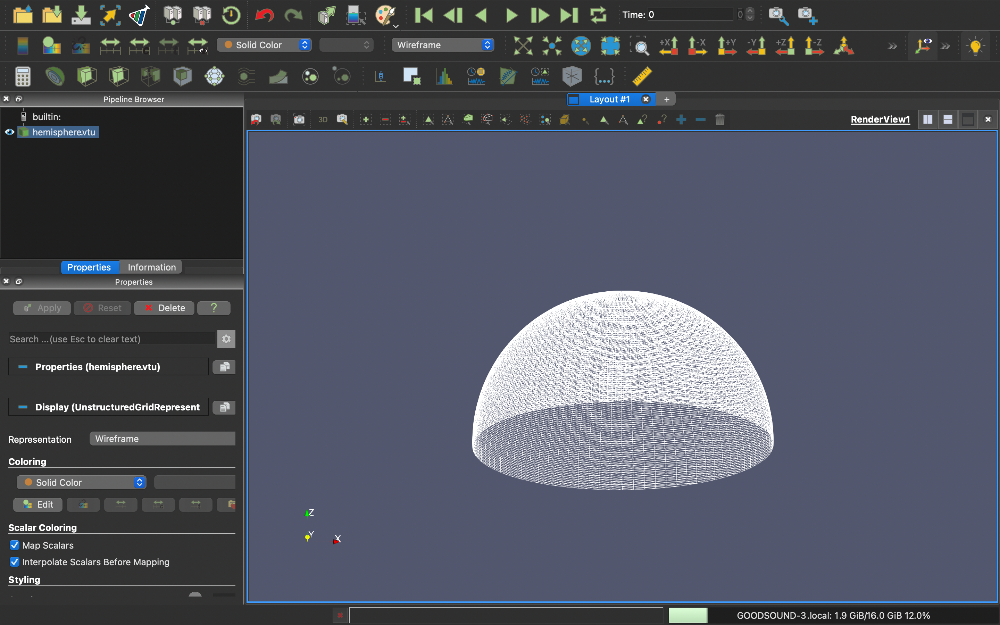

## 📍 Introduction

The Visualization Toolkit (VTK) is an open-source, freely available software system for 3D computer graphics, modeling, image processing, volume rendering, scientific visualization, and 2D plotting. It supports a wide variety of visualization algorithms and advanced modeling techniques, and it takes advantage of both threaded and distributed memory parallel processing for speed and scalability, respectively.

The origin of VTK is with the textbook "The Visualization Toolkit, an Object-Oriented Approach to 3D Graphics" originally published by Prentice Hall and now published by Kitware, Inc. (Third Edition ISBN 1-930934-07-6). VTK has grown (since its initial release in 1994) to a world-wide user base in the commercial, academic, and research communities.

As open source software, VTK is free to use for any purpose. Technically, VTK has a BSD-style license, which imposes minimal restrictions for both open and closed source applications.

ParaView is an open-source, multi-platform data analysis and visualization application. ParaView is known and used in many different communities to analyze and visualize scientific data sets. It can be used to build visualizations to analyze data using qualitative and quantitative techniques. The data exploration can be done interactively in 3D or programmatically using ParaView's batch processing capabilities.

### Paraview Examples

### Project Introduction

Complete the hemisphere by stacking the triangles in the same way as in this picture.

## 💡 Preview

- type : surface

- type : wireframe

## 🎯 Getting Started
### Requirements
- Paraview 5.x **(5.11.x for mac)**

In general VTK tries to be as portable as possible; the specific configurations below are known to work and tested.

VTK supports the following compilers:

1. GCC 4.8 or newer
2. Clang 3.3 or newer
3. Apple Clang 5.0 (from Xcode 5.0) or newer
4. Microsoft Visual Studio 2015 or newer
5. Intel 14.0 or newer

VTK supports the following operating systems:

1. Windows Vista or newer
2. Mac OS X 10.7 or newer
3. Linux (ex: Ubuntu 12.04 or newer, Debian 4 or newer)

## 📝 License
VTK is distributed under the OSI-approved BSD 3-clause License. See [LICENSE.txt](https://github.com/solheeing/makeHemisphere/blob/main/License.txt) for details.

## 👩🏻‍💻 Author
Eunsori Cho, [@solheeing](https://github.com/solheeing)
